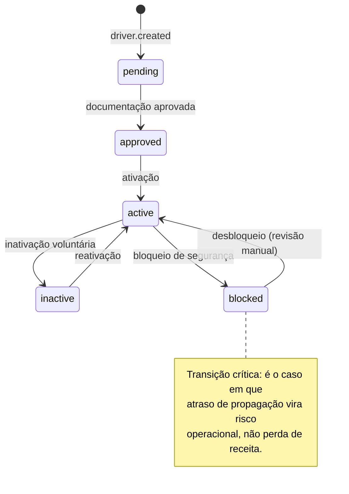

# Modelo de Dados

Estruturas dos dois lados da fronteira. O DDL está em PostgreSQL por ser o padrão do
ecossistema Rails; o que importa não é o dialeto, são as **restrições** — cada índice único
e cada `CHECK` aqui é um invariante da constituição materializado no banco, no ponto em que
nem um agente de IA nem um humano distraído consegue contorná-lo pela aplicação.

---

## Lado produtor — Portal dos Entregadores

### `drivers` (system of record)

```sql
CREATE TABLE drivers (
  id                 UUID PRIMARY KEY,
  document_ref       TEXT        NOT NULL,   -- referência ao cofre de PII, nunca o CPF/CNPJ
  legal_entity_type  TEXT        NOT NULL,   -- 'individual' | 'company'
  status             TEXT        NOT NULL,   -- 'pending' | 'approved' | 'active' | 'inactive' | 'blocked'
  documents_status   TEXT        NOT NULL,   -- 'pending' | 'approved' | 'expired' | 'rejected'
  vehicle_type       TEXT,                   -- 'motorcycle' | 'bicycle' | 'car' | 'van'
  service_radius_km  INTEGER,
  service_modes      TEXT[]      NOT NULL DEFAULT '{}',  -- 'goods' | 'food'
  aggregate_version  BIGINT      NOT NULL DEFAULT 0,
  updated_at         TIMESTAMPTZ NOT NULL,
  created_at         TIMESTAMPTZ NOT NULL,

  CONSTRAINT drivers_version_positive CHECK (aggregate_version >= 0)
);

-- Cursor estável da reconciliação (ADR-08). Ordem por (updated_at, id) evita
-- OFFSET, que sob escrita concorrente pula e repete linhas.
CREATE INDEX idx_drivers_reconciliation ON drivers (updated_at, id);
```

`aggregate_version` é incrementado **na mesma transação** que qualquer mudança de estado.
É a ordem canônica de todo o sistema (ADR-02).

### `driver_outbox`

```sql
CREATE TABLE driver_outbox (
  id                 BIGSERIAL PRIMARY KEY,
  event_id           UUID        NOT NULL,   -- UUIDv7: ordenável por tempo
  driver_id          UUID        NOT NULL,
  event_type         TEXT        NOT NULL,   -- driver.created | driver.updated | driver.status_changed
  aggregate_version  BIGINT      NOT NULL,
  payload            JSONB       NOT NULL,   -- fato completo, validado contra o AsyncAPI
  correlation_id     UUID        NOT NULL,
  occurred_at        TIMESTAMPTZ NOT NULL,
  published_at       TIMESTAMPTZ,
  attempts           INTEGER     NOT NULL DEFAULT 0,
  last_error         TEXT,

  CONSTRAINT outbox_event_id_unique UNIQUE (event_id),
  -- Um agregado nunca emite duas versoes iguais. Esta restricao e a
  -- ultima linha de defesa da monotonicidade (Principio II): se a
  -- aplicacao tentar violar, a transacao inteira falha.
  CONSTRAINT outbox_version_unique  UNIQUE (driver_id, aggregate_version)
);

-- Indice parcial: o relay so enxerga o que falta publicar. Mantem a
-- varredura barata mesmo com a tabela grande antes da poda.
CREATE INDEX idx_outbox_unpublished
  ON driver_outbox (id) WHERE published_at IS NULL;
```

Consulta do relay, com `SKIP LOCKED` permitindo múltiplas réplicas sem disputa:

```sql
SELECT * FROM driver_outbox
WHERE published_at IS NULL
ORDER BY id
LIMIT 500
FOR UPDATE SKIP LOCKED;
```

**Métrica mais importante do sistema:** *outbox lag* — idade da linha não publicada mais
antiga. Ela detecta relay parado, broker fora e degradação de rede com um único sinal, e
antecede a violação do SLA.

**Poda:** partição mensal; linhas publicadas há mais de 7 dias são descartadas por
`DROP PARTITION`, alinhado à retenção do broker (ADR-05).

---

## Lado consumidor — Ultra-rápida

### `driver_projections`

```sql
CREATE TABLE driver_projections (
  driver_id          UUID PRIMARY KEY,
  legal_entity_type  TEXT        NOT NULL,
  status             TEXT        NOT NULL,
  documents_status   TEXT        NOT NULL,
  vehicle_type       TEXT,
  service_radius_km  INTEGER,
  service_modes      TEXT[]      NOT NULL DEFAULT '{}',

  aggregate_version  BIGINT      NOT NULL,   -- versao do ultimo evento aplicado
  last_synced_at     TIMESTAMPTZ NOT NULL,   -- Principio VII: frescor verificavel
  eligible           BOOLEAN     NOT NULL DEFAULT FALSE,
  ineligibility_reason TEXT,
  evaluated_at_version BIGINT,               -- versao que originou o veredito (RF-06)

  updated_at         TIMESTAMPTZ NOT NULL
);

-- Pool de despacho: apenas elegiveis com estado fresco.
-- O predicado de frescor e aplicado na consulta, contra last_synced_at.
CREATE INDEX idx_projections_dispatch_pool
  ON driver_projections (last_synced_at)
  WHERE eligible = TRUE;
```

Escrita condicional — a guarda de versão vive no `WHERE`, não num `if` da aplicação
(ADR-03):

```sql
UPDATE driver_projections
   SET status = :status, aggregate_version = :version, last_synced_at = NOW(), ...
 WHERE driver_id = :id
   AND aggregate_version < :version;
-- 0 linhas afetadas = evento obsoleto ou duplicado. Descartar com metrica,
-- nunca retentar: nao e falha, e a ordem correta se impondo.
```

Consulta do pool de despacho, com o TTL de frescor aplicado:

```sql
SELECT driver_id FROM driver_projections
WHERE eligible = TRUE
  AND last_synced_at > NOW() - INTERVAL '15 minutes';
```

Um entregador com `status = 'active'` mas `last_synced_at` expirado **não aparece**. É a
materialização do Princípio VII: o registro precisa provar que continua válido.

### `processed_events` (barreira de deduplicação)

```sql
CREATE TABLE processed_events (
  event_id      UUID PRIMARY KEY,
  driver_id     UUID        NOT NULL,
  processed_at  TIMESTAMPTZ NOT NULL DEFAULT NOW()
);

CREATE INDEX idx_processed_events_ttl ON processed_events (processed_at);
```

Gravada **na mesma transação** que a atualização da projeção. Protege efeitos colaterais
externos, não o estado — o estado já está protegido pela guarda de versão (ADR-04). TTL de
7 dias.

### `reconciliation_cursors`

```sql
CREATE TABLE reconciliation_cursors (
  consumer_name    TEXT PRIMARY KEY,
  last_updated_at  TIMESTAMPTZ NOT NULL,
  last_id          UUID        NOT NULL,
  run_started_at   TIMESTAMPTZ,
  drivers_scanned  BIGINT      NOT NULL DEFAULT 0
);
```

O par `(last_updated_at, last_id)` é o cursor estável. Persistido para que a varredura
retome de onde parou caso o processo de reconciliação morra no meio — reiniciar do zero
após 8 dos 10 minutos de varredura é desperdício de orçamento do banco do Portal.

---

## Máquina de estados do entregador



Apenas `active` é candidato ao pool de despacho — e ainda assim sujeito à elegibilidade
local (ADR-06) e ao TTL de frescor (Princípio VII). São três filtros independentes, e a
falha de qualquer um deles resulta em **não despachar**, nunca em despachar indevidamente.
